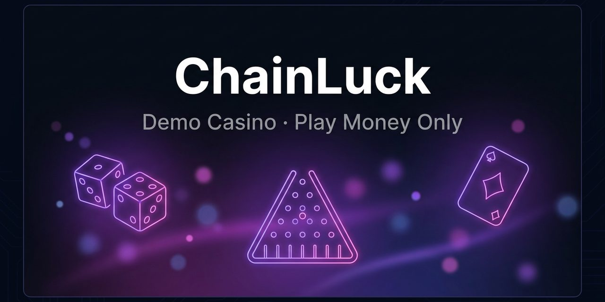

# ⚡ ChainLuck — Demo Casino (Play Money Only)

Interactive demo crypto casino: **Dice, Plinko, Blackjack, Slots** with a
fake "DemoMask" wallet. 100% play money — no real funds, no blockchain
transactions, nothing is ever signed or sent.

  

## Features

- 🎲 **Provably-fair Dice** · 🔺 **Plinko** · 🃏 **Blackjack** · 🎰 **Slots**
- 👛 **Demo wallet** — read-only MetaMask connect, balance in DEMO tokens
- 📊 **Session stats** — session time, net result, RTP ≈ 92–99%
- 📱 **Mobile-first** dark neon UI, hash-routed SPA (no page reloads)
- 🚀 **CI/CD** — deployed to GitHub Pages from `main` via Actions

## Play

**https://itsfedor.github.io/demo-casino**

## Tech stack

- Vanilla JavaScript (hash-routing SPA, ES modules)
- CSS custom properties, neon theme, no frameworks
- GitHub Actions → Pages deployment

## Note

Built as a UI/UX and game-logic showcase. 18+. Play money only.

## License

[MIT](LICENSE)
